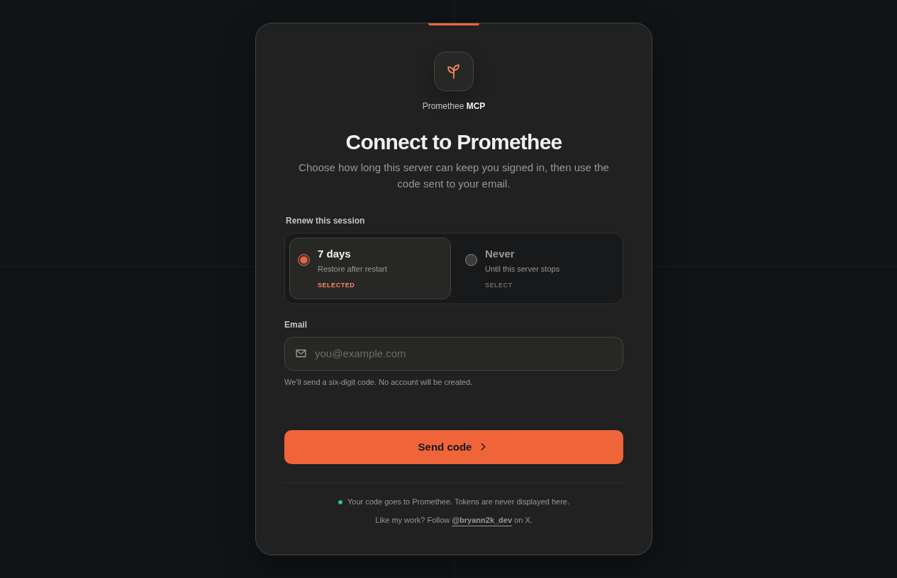

<p align="center">
  
</p>

# Promethee MCP

> A local-first MCP server for working with Promethee tasks and projects from an AI assistant.

Promethee MCP lets Codex, Claude Code, and other stdio MCP clients list tasks and projects, inspect one task, and create a task or project when you explicitly request it. Authentication happens on a passwordless page hosted by the MCP on `127.0.0.1`; the email code and session tokens never enter the AI conversation.

The project is public, unofficial, and built with TypeScript, the MCP TypeScript SDK, and npm. It does not extract credentials from the Promethee desktop application and does not contain a service-role key.

<p align="center">
  
</p>

## What it does

- Connects an independently verified Promethee account through a local browser page.
- Lists bounded pages of tasks and projects for the connected user.
- Reads one task by identifier without exposing arbitrary database access.
- Creates tasks and projects through narrow, validated MCP tools.
- Keeps user content in structured MCP results instead of mixing it into instruction text.
- Restores one encrypted session for at most seven days, or keeps it only in memory.
- Runs as a user-scoped stdio server in Codex, Claude Code, and generic MCP clients.

## Why sign-in stays private

The MCP starts its own loopback login page and gives the client a URL such as `http://127.0.0.1:3210/login`. You choose **7 days** or **Never**, enter your email, and verify the six-digit code in that browser page.

The page pairs the verified session directly with the running MCP process. The assistant sees only connection status — never the email code, access token, refresh token, desktop cookies, or local Promethee session files.

Seven-day retention uses an AES-256-GCM envelope stored in the operating-system user configuration directory. Concurrent MCP processes use locked atomic updates and compare-and-swap transitions so a stale process cannot erase a newer session. **Never** stores no token material after the server stops.

## Install

Promethee MCP is distributed as an immutable GitHub Release archive. Node.js `>=22.14.0 <23` is required.

You can ask your assistant to configure it:

```text
Install Promethee MCP as a user-scoped stdio server. Use npx with the reviewed GitHub Release archive
https://github.com/BRYANN2K/promethee-mcp/releases/download/v0.1.2/promethee-mcp-0.1.2.tgz and the prometheemcp --stdio executable.
Reconnect the MCP, call promethee_connection_status, and give me its login URL.
Never ask me to paste the email code or tokens into the conversation.
```

Or launch the interactive installer yourself:

```bash
npx -y \
  --package=https://github.com/BRYANN2K/promethee-mcp/releases/download/v0.1.2/promethee-mcp-0.1.2.tgz \
  -- prometheemcp
```

The installer prints the exact command first and changes a client configuration only after confirmation.

### Codex

```bash
codex mcp add promethee -- \
  npx -y \
  --package=https://github.com/BRYANN2K/promethee-mcp/releases/download/v0.1.2/promethee-mcp-0.1.2.tgz \
  -- prometheemcp --stdio
```

### Claude Code

```bash
claude mcp add --scope user promethee -- \
  npx -y \
  --package=https://github.com/BRYANN2K/promethee-mcp/releases/download/v0.1.2/promethee-mcp-0.1.2.tgz \
  -- prometheemcp --stdio
```

### Generic MCP configuration

```json
{
  "mcpServers": {
    "promethee": {
      "command": "npx",
      "args": [
        "-y",
        "--package=https://github.com/BRYANN2K/promethee-mcp/releases/download/v0.1.2/promethee-mcp-0.1.2.tgz",
        "--",
        "prometheemcp",
        "--stdio"
      ]
    }
  }
}
```

## How to use it

1. Start or reconnect the `promethee` MCP server in your client.
2. Ask the assistant to connect Promethee.
3. Open the loopback URL returned by `promethee_connection_status`.
4. Choose the retention mode, enter your email, and verify the code in the browser.
5. Ask for a task or project action normally. The running MCP detects the connection without a reinstall.

Examples:

```text
List my open Promethee tasks.
Show task <task-id>.
Create a project named Client Portal.
Create a task named Review onboarding in project <project-id>.
```

## Available tools

| Tool | Effect |
| --- | --- |
| `promethee_connection_status` | Reports connection state and returns the local login URL when disconnected. |
| `promethee_list_tasks` | Lists a bounded page of the connected user's tasks. |
| `promethee_get_task` | Reads one task by identifier. |
| `promethee_list_projects` | Lists a bounded page of the connected user's projects. |
| `promethee_create_project` | Creates one project through a validated, idempotent input. |
| `promethee_create_task` | Creates one task through a validated, idempotent input. |

## Local-first privacy

- Authentication is independent from the Promethee desktop application's tokens, cookies, SQLite files, and private IPC.
- The browser bridge accepts only exact loopback origins and bounded session inputs.
- The MCP exposes fixed task/project operations — not arbitrary PostgREST, SQL, RPC, Storage, Realtime, or Edge Function access.
- Identity comes from the verified session rather than a caller-supplied user ID.
- Promethee's row-level security remains authoritative.
- No service-role or other RLS-bypassing credential is included.
- Ordinary tests use synthetic sessions and mocked upstream responses; they do not contact or mutate Promethee.
- No telemetry is included.

## Integration status

The local personal mode is implemented, packaged, and covered from browser pairing through MCP tool execution with controlled test sessions. Live compatibility remains version-sensitive because this is not an official Promethee integration.

The repository also contains a separate publisher-oriented Supabase/OAuth composition and a single-user Docker Compose/Caddy deployment candidate. Those paths remain gated on publisher-owned OAuth clients, scopes, RPC contracts, RLS policy, quotas, staging evidence, and operational acceptance. No container image or hosted deployment is published.

## Development and validation

Install the locked dependencies and run the complete local checks:

```bash
npm ci --ignore-scripts
npm run check
npm run test:package

cd web
npm ci --ignore-scripts
npm run check
```

The release smoke-test builds the package archive, installs that exact tarball through `npx`, verifies CLI version/help, starts stdio, completes an MCP handshake, discovers all tools, and checks the local login route.

Useful CLI commands after `npm run build`:

```bash
npm run cli -- --help
npm run cli -- doctor --json
npm run cli -- doctor --mode personal --json
npm run cli -- serve --mode personal --port 3210
```

`doctor` is offline and never prints keys, tokens, client policy, edge secrets, or MCP bearer values.

## Self-hosting

The checked-in Compose topology places the MCP on a private network behind Caddy. Never publish the MCP container port directly. Start with the [self-hosting guide](docs/operations/self-hosting.md) and [security checklist](docs/operations/security-checklist.md).

For a VPS handoff, give the operator or agent this instruction:

```text
Install the public GitHub release BRYANN2K/promethee-mcp at the exact v0.1.2 tag.
Read docs/operations/self-hosting.md before making changes. Keep operator-owned secrets outside Git,
validate the Compose configuration, build it, start it, and report health and MCP discovery results.
Never expose port 3210 directly and never print secrets or Promethee tokens.
```

## Documentation

Start with the [documentation map](docs/README.md), then use:

- [System overview](docs/architecture/system-overview.md)
- [Authentication and authorization](docs/architecture/authentication-and-authorization.md)
- [Data flow and trust boundaries](docs/architecture/data-flow-and-trust-boundaries.md)
- [Threat model](docs/architecture/threat-model.md)
- [MCP contract](docs/api/mcp-contract.md)
- [Self-hosting guide](docs/operations/self-hosting.md)
- [Architecture decisions](docs/adr/README.md)
- [Promethee integration request](docs/handover/promethee-integration-request.md)

## Project boundary

This repository is public for an unofficial source release. No license has been selected. Nothing here implies Promethee ownership, endorsement, guaranteed compatibility, or production authorization.
